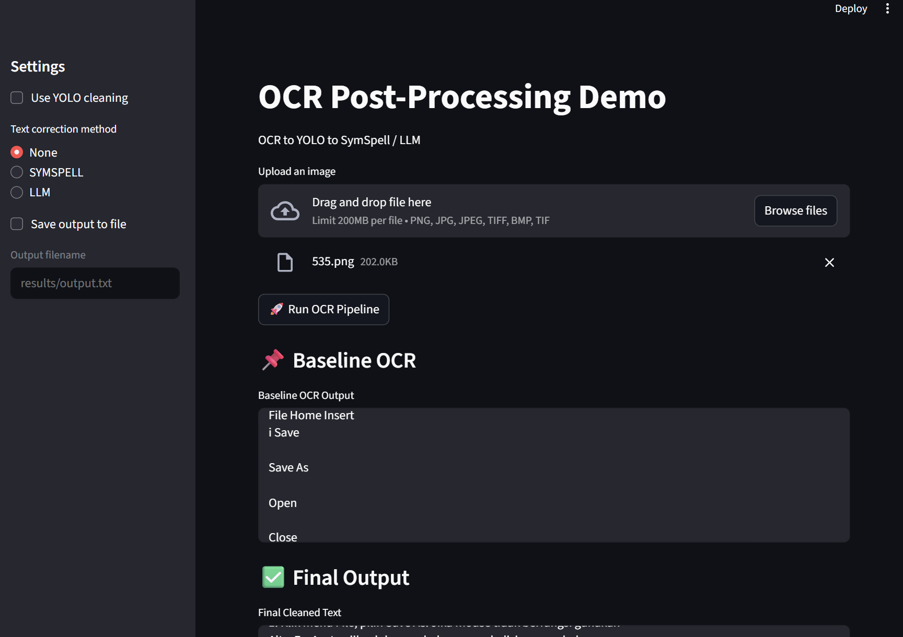

# Research Methodology Final Project

**Title:** A Multimodal AI Framework for Layout-Aware OCR Post-Processing in Indonesian Academic Documents

**Members:**
- Ella Raputri (2702298154) 
- Ellis Raputri (2702298116)
- Vammy Johannis Jiang (2702368122)

**Class:** L5AC

<br>

## Project Description
This project develops a multimodal AI pipeline using object detection model (YOLO) and a text correction method (Symspell + NER or LLM) for OCR post-processing. Object detection model is used to detect specific regions inside the Indonesian document page and clean it, while a text correction method is used to correct the typos inside the OCR text. For demo purposes. we also incorporated a text-to-speech model to generate the final cleaned text. 

<br>

## Setup Process
*Note: not all the data are available in the repository due to the file size. Therefore, if you are interested to run all the files (not only the demos), kindly consult with us, so that we can send you all the files needed. 

### Cloning the Repository

- Clone the repository.
    ```bash
    git clone https://github.com/Ella-Raputri/ResearchMethodology-FinalProject.git
    ```

- Change directory to the respective directory.
    ```bash
    cd ResearchMethodology-FinalProject
    ```

<br>

### Activating Virtual Environment
#### Option A — Using Python Virtual Environment (`venv`)

- Create a virtual environment
    ```bash
    python -m venv .venv
    ```

- Activate the virtual environment

    **Windows (PowerShell / Command Prompt)**
    ```bash
    .venv\Scripts\activate
    ```

    **macOS / Linux**
    ```bash
    source .venv/bin/activate
    ```
<br>

#### Option B — Using Conda
- Create a conda environment
    ```bash
    conda create -n rm-env python=3.12.12 -y
    ```

- Activate the conda environment
    ```bash
    conda activate rm-env
    ```

<br>

### Installing All Dependencies
After the virtual environment is activated, install all dependencies.
```bash
pip install -r requirements.txt
```
Make sure that Tesseract OCR Engine is installed in your device. You can view the complete installation guide and documentation in this [link](https://tesseract-ocr.github.io/tessdoc/Installation.html).

For now, we only uploaded the required files that are used in the demo and can be downloaded from this [link](https://drive.google.com/drive/folders/1br9uB9SFP0U7l-I5eknYN3DxlBXX9uxA?usp=sharing). 

After downloading the YOLO model (best.pt) and Symspell dictionary. Make sure that you update the paths in yolo_cleaning.py and symspell.py in the demo folder to the downloaded files path.

For this project, we also need a HF token and a Gemini API key, ensure that you have them and store them in the .env file.

<br>


## Running the Demo
Navigate to the demo folder.
```bash
cd demo
```

### Option A - CLI (Command Line Interface)
Below is the basic syntax to run the demo.
```text
python main.py <image_path> [options]
```
Positional argument:
- src: path to the input image file

Optional arguments (flag):
- --yolo: Enable YOLO-based OCR region cleaning
- --text-clean {symspell,llm}: Apply text correction using SymSpell or LLM
- --save-output <path>: Save the final cleaned text to a .txt file
- --save-speech <path>: Save the synthesized speech output to a .wav file

Examples:
- Baseline (OCR only)
    ```bash
    python main.py test.png
    ```
- OCR + YOLO cleaning
    ```bash
    python main.py test.png --yolo
    ```
- OCR + YOLO cleaning + Symspell
    ```bash
    python main.py test.png --yolo --text-clean symspell
    ```
- OCR + YOLO cleaning + LLM
    ```bash
    python main.py test.png --yolo --text-clean llm
    ```
- OCR + YOLO cleaning + LLM + save output and speech
    ```bash
    python main.py test.png --yolo --text-clean llm --save-output out1.txt --save-speech cli.wav
    ```


### Option B - Streamlit (GUI)
Run the Streamlit app.
```bash
streamlit run app.py
```
Access the app in localhost:8501 (by default). Here is the demo GUI image.
<br>

<br> 

## Demo Video
You can also see our demo video in [here](https://drive.google.com/file/d/1-mkmQBCFmD1A4QwMY6OPQEsArwOM19VO/view?usp=sharing)

<br>


## Files and Folders

<details>
<summary> <b>Folder data</b> </summary>

In this GitHub repository, there is only the raw folder inside this folder, which contains our manual data collection. Below are the following files inside the raw folder.

- ground_truth: ground truth for each page
- ocr_dict: the ocr json output of PyTesseract, contains the positions of each text detected.
- ocr_result: the ocr text output of PyTesseract
- source_file: the document pages file that we manually collected. 
- ocr_data.ipynb: the bulk processing for the pages to generate the baseline. 

</details>

<br>

<details>
<summary> <b>Folder demo</b> </summary>

Contains the files that are used for our OCR post-processing pipeline demo.

- utils folder: contains all the functionality needed for the demo from the OCR, YOLO object detection and cleaning, Symspell cleaning, LLM cleaning, and Text to Speech function.
- app.py: the streamlit demo file
- main.py: the CLI demo file
- test.png: the image sample that we can use for the demo

</details>

<br>

<details>
<summary> <b>Folder evaluation</b> </summary>

Contains files for the evaluation of the OCR post-processing framework.

- object_detection: contains the evaluation code and result for evaluating the YOLO model and the YOLO cleaning result
- text_processing: contains the evaluation code and result for evaluating the cleaning using text processing methods (Symspell or LLM)
- barchart.png: the overall bar chart result for each metric and each tested variant
- eval_list.txt: 100 random stratified sampled images for final testing
- final_eval.ipynb: the evaluation code for the testing for final refined variant
- final_with_indobert_jw.csv: the evaluation result from final_eval.ipynb
- sampling.ipynb: the code for sampling the testing dataset
- statistic.ipynb: the code for statistical hypothesis testing
- visualization.ipynb: the code to visualize barchart.png

</details>

<br>

<details>
<summary> <b>Folder text-processing</b> </summary>

Contains two folders which are cleaning using algorithm (Symspell) or LLM-test (LLM). Each folder contains the code and evaluation result after the cleaning. The result folder that has the 'final_' prefix indicates that it is conducted after the text cleaning with YOLO. 

</details>

<br>

<details>
<summary> <b>Folder yolo</b> </summary>

Contains two folders which are preprocess and training (includes the code to filter DocLayNet (our secondary dataset), review the annotated bounding box, split the training data into 5-fold, and the YOLO training code) and yolo_res that stores the result after YOLO cleaning only. Meanwhile, the exclude_noise.ipynb is the main code that is used to conduct the cleaning.

</details>

<br>


## Contact
If you are experiencing any problems, please contact us:
- Instagram: [Click here](https://instagram.com/raputriella?igshid=OGQ5ZDc2ODk2ZA==)
- Whatsapp: [Click here](https://wa.me/62895629504490)
- Phone number: +62895629504490